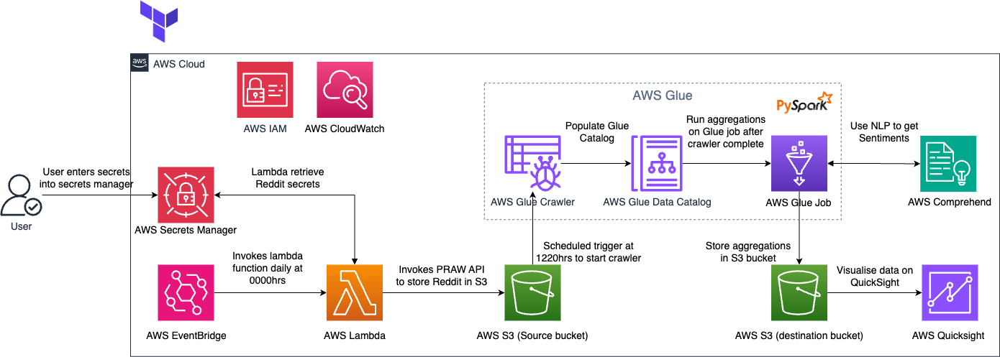

# is459-assignment2

## Problem Statement
The Israel-Palestine conflict has had a lot of buzz lately due to the countless war crimes and inhumane acts by the armed forces.

As bystanders, particularly from other countries, might have less empathy for their situation and might not understand what is going on and why is it happening.

We turn to social media such as forums like Reddit to find out more, it is hence essential to identify unreliable threads online so that we are not biased.

## Proposed Solution
Big data pipeline combined with NLP to tag posts and also provide insights on the topic as a whole.

Batch data ingestion and data processing (Daily).

## Architecture


## How to set up the project

1. Clone the repository
2. cd `backend/lambda/lambda_layer` directory, and run the following commands:

```
chmod +x build.sh
./build.sh
```
- :memo: **Note:** This can be automated in a CI/CD pipeline, it will create a zip file containing the python dependencies needed for the lambda functions to run, to add more libraries, add them to the requirements.txt file and run the build.sh script again.

3. Under the terraform directory (change directory there!), create a terraform.tfvars file with the following content:

```
AWS_ACCESS_KEY_ID     = "your_aws_access_key_id"
AWS_SECRET_ACCESS_KEY = "your_aws_secret_access_key"
AWS_ACCOUNT_ID        = "your_aws_account_id"
AWS_REGION            = "your_aws_region"
```

4. Run the following commands:

```
cd terraform
terraform init
terraform apply
```

5. After the terraform script is done, you will have to go to the AWS console and configure the Reddit credentials (client_id, client_secret, password, username, user_agent) at Secrets Manager.
- :memo: **Note:** An alternative to secrets manager is to pass the secrets via the CI/CD pipeline directly into the environment variables of the lambda functions.

6. After the infrastructure is set up, you can either wait for the pipeline to run at 0000 hrs, or you can manually trigger the pipeline by going to the AWS console, and triggering the pipeline manually (Invoke Lambda function -> Run Glue Crawlers)

7. Once the data is ready, you can query the data using Athena or QuickSight.
    - If using Athena, note that the data is partitioned by year, month, and day.

8. The prepare_s3_manifest.py script is used to generate the manifest file for the crawler to crawl the data in S3. The manifest file can be found in the data bucket in the manifests folder and you will have to copy the link to the manifest file and paste it when configuring QuickSignt.

9. Ensure that the QuickSight user has access to the data bucket in S3.

### Costs
Do note that costs will be incurred when running the pipeline, as the glue crawler will crawl the data in S3 and there will be a glue job run which will be charged.
Link to AWS cost calculator:
https://calculator.aws/#/


### Future Works
- Hopefully, Reddit will be able to embed the sentiments into their UI for posts and comments
- Make the pipeline more generic so that it can be used for other topics
- Make the pipeline real-time
- Add other data sources such as Twitter, Facebook, Instagram, etc.
- Add more NLP features such as sentiment analysis, topic modelling, etc.
- Add more visualizations in QuickSight or other visualisations tools such as Tableau, PowerBI, etc.
- Hopefully, the conflict will end soon.


### Credits
Followed this guide to set up Reddit API:
https://rymur.github.io/setup

Used PRAW Python library to interact with Reddit API:
PRAW documentation:
https://praw.readthedocs.io/en/stable/index.html

